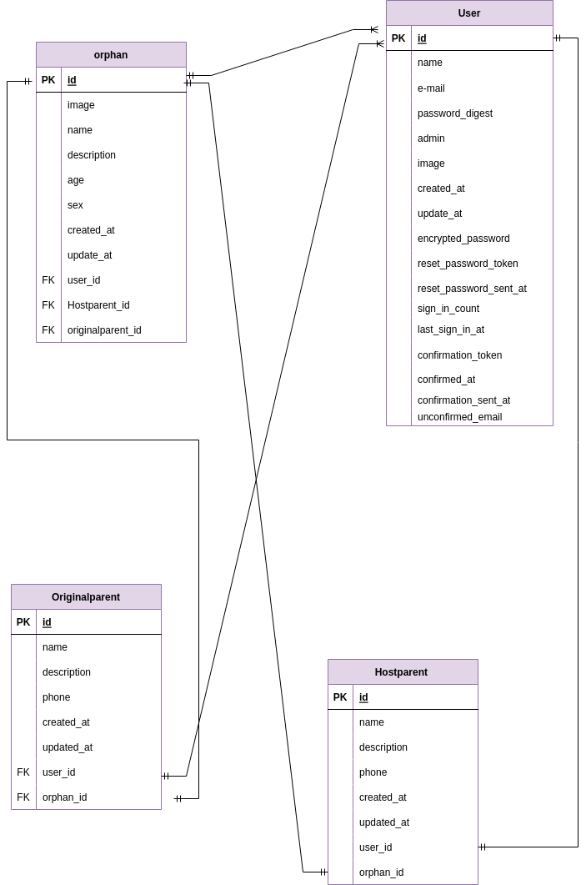

# README

This README would normally document whatever steps are necessary to get the
application up and running.

Things you may want to cover:

* Ruby version
. Rubis3.0.1p64

. Rails 6.0.6

procédure d'exécution

$ git clone https://github.com/Lahanatou/GestOrf.git

$ cd Gestorf

$ installation groupée

$ rails db:créer && rails db:migrate

$ rails s

* System dependencies

* Configuration

* Database creation

* Database initialization

* How to run the test suite

* Services (job queues, cache servers, search engines, etc.)

* Deployment instructions

* GestOrf
liste de contrôle

## Checksheet
[Checksheet](https://docs.google.com/spreadsheets/d/1Ebcr4070bLf0bqVJuf3X5AjHD8qpl-mOwtJIiaz7T1U/edit?usp=share_link)

## Catalogue Design
[Catalogue Design](https://docs.google.com/spreadsheets/d/16X29JAXK2BVKWywn5qZUYorU7AWzt9xknwWHEx5Mlfw/edit?usp=share_link)

## Table Definition
[Table Definition](https://docs.google.com/spreadsheets/d/1BJVS7bI4hDVIdjZy_yT42PkQuZAOf6BnWPAGczzUqK4/edit?usp=share_link)

## ER Diagram
[ER Diagram](https://drive.google.com/file/d/1jiS_bOtWC1ibEtJKFxW4pnyDo2YR0irB/view?usp=share_link) 

## Screen transition diagram
[screen transition](https://drive.google.com/file/d/1pXrkv6d5KgVR0-J3ZUB1VpvCVOG7yIMy/view?usp=share_link) 

## Wireframe
[Wireframe](https://drive.google.com/file/d/1G8tyAVkerbyPkKJmUnU05S2IK3_RQGjx/view?usp=share_link) 
